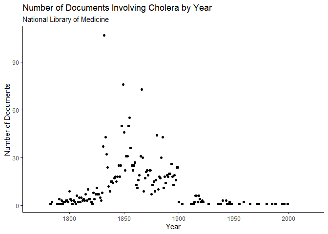

# tidynlm

## Overview

tidynlm provides easy access to the National Library of Medicine (NLM)
API from within R. The package allows the user to create a dataframe of
NLM documents matching a particular search query using the function
`searchnlm`. The resulting dataframe contains information on attributes
such as authorship and date and place of publication. The documents
themselves can be accessed with the urls in the url column of the
resulting dataframe.

## Installation

You can install the released version of tidynlm from
[GitHub](https://github.com/Reed-Statistics/book_trackR) with:

``` r
# install.packages("devtools")
devtools::install_github("https://github.com/Reed-Statistics/book_trackR")
```

## Usage

`tidynlm` gives access to the NLM API through the function `searchnlm`,
which accepts the arguments:

  - `term` is the search term(s)
  - `field` is the field to search in
  - `retmax` is the number of documents to search
  - `email` allows the NLM to track your API requests
  - `output` determines if a row is a field or a document
  - `collapse_to_first` removes duplicated fields if set to TRUE
  - `print_url` prints the queried URL if set to TRUE

<!-- end list -->

``` r
library(tidynlm)
library(tidyverse)
#> Warning: package 'tidyverse' was built under R version 3.6.3
#> -- Attaching packages ----------------------------------------------------------------------------------------- tidyverse 1.3.0 --
#> v ggplot2 3.3.0     v purrr   0.3.3
#> v tibble  2.1.3     v dplyr   0.8.5
#> v tidyr   1.0.2     v stringr 1.4.0
#> v readr   1.3.1     v forcats 0.5.0
#> Warning: package 'ggplot2' was built under R version 3.6.3
#> Warning: package 'dplyr' was built under R version 3.6.3
#> Warning: package 'forcats' was built under R version 3.6.3
#> -- Conflicts -------------------------------------------------------------------------------------------- tidyverse_conflicts() --
#> x dplyr::filter() masks stats::filter()
#> x dplyr::lag()    masks stats::lag()

# see the first 10 field-value pairs of Cholera documents
searchnlm(term = "cholera", retmax = 10) %>%
  print()
#> [1] "check if triggered: tall"
#> NULL

# see the first 100 Cholera documents with the possibility of duplicated fields in the form of list-cols
searchnlm(term = "cholera", retmax = 100, output = "wide") %>%
  print()
#> [1] "check if triggered: wide without listcols"
#> NULL

# query the NLM database for documents pertaining to Cholera and drop duplicated fields
cholera <- searchnlm(term = "cholera", retmax = 10000, output = "wide", collapse_to_first = TRUE)
print(cholera)
#> # A tibble: 2,000 x 17
#> # Groups:   rank, url [2,000]
#>   rank  url   dc.date title creator subject description Publication contributor
#>   <chr> <chr> <chr>   <chr> <chr>   <chr>   <chr>       <chr>       <chr>      
#> 1 0     http~ 1881    "The~ Bell, ~ "Diarr~ 2nd ed. / ~ New York :~ Laird, W. ~
#> 2 1     http~ 1888    "The~ Bell, ~ "Diarr~ 3rd ed      Philadelph~ <NA>       
#> 3 2     http~ 1870    "The~ Bell, ~ "Gastr~ <NA>        New York, ~ <NA>       
#> 4 3     http~ 1893    "The~ Majumd~ "<span~ <NA>        Philadelph~ <NA>       
#> 5 4     http~ 1852    "<sp~ Balfou~ "<span~ <NA>        Madras : F~ <NA>       
#> # ... with 1,995 more rows, and 8 more variables: format <chr>,
#> #   identifier <chr>, language <chr>, rights <chr>, snippet <chr>, type <chr>,
#> #   coverage <chr>, relation <chr>
```

In this example, we will chart the number of documents pertaining to
Cholera in the National Library of Medicine by year. To do so, we will
first query the NLM database using `searchnlm`. We will then aggregate
the resulting dataframe by year and plot it.

``` r
cholera %>%
  mutate(dc.date = as.numeric(dc.date)) %>%
  group_by(dc.date) %>%
  count() %>%
  ungroup() %>%
  ggplot(aes(x = dc.date, y = n)) +
  geom_point() +
  xlim(1770, 2020) +
  theme_classic() +
  labs(x = "Year",
       y = "Number of Documents",
       title = "Number of Documents Involving Cholera by Year",
       subtitle = "National Library of Medicine")
#> Warning: Removed 8 rows containing missing values (geom_point).
```


